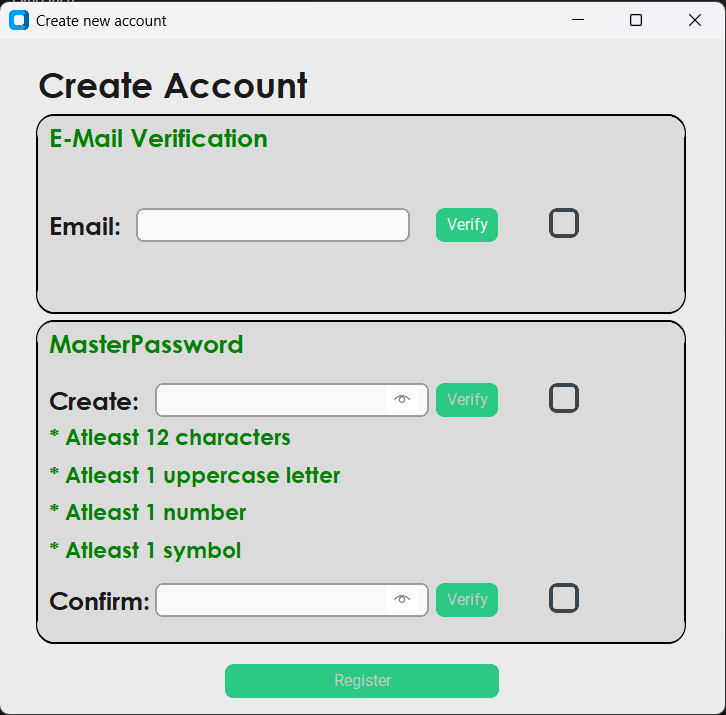

# SafePassX - Secure Password Manager

A modern, secure password management application built with Python that helps you store and manage your passwords safely. It features a user-friendly GUI interface and robust security measures to protect your sensitive information.

## ✨ Key Highlights

* 🔐 **Advanced Security**:
  * AES encryption for password storage
  * Master password protection with SHA-256 hashing
  * Email verification for account security
* 📱 **Modern GUI**: Built with CustomTkinter for a sleek, user-friendly interface
* 📋 **Organized Storage**: Password categorization (Mail, Social Media, E-Commerce, etc.)
* 🔄 **Smart Features**:
  * Strong password generation (12 characters with mixed case, numbers, and symbols)
  * Password strength checker
  * Copy to clipboard functionality
  * Password regeneration capability

## 🧰 Technologies Used

* Python 3.x
* CustomTkinter
* MySQL + MySQL Connector for Python
* PyCrypto for AES encryption
* `hashlib` for password hashing
* `pyperclip` for clipboard operations

## 🚀 Getting Started

1. **Clone the repository**:
```bash
git clone https://github.com/yourusername/SafePassX.git
cd SafePassX
```

2. **Install dependencies**:
```bash
pip install customtkinter mysql-connector-python pycryptodome pyperclip pillow
```

3. **Set up MySQL**:
   - Install MySQL Server if not already installed
   - Create a MySQL user or use the default root user
   - Update the MySQL credentials in `SafePassX.py`:
     ```python
     sql = mysql.connector.connect(
         host="localhost",
         user="root",  # Change if using a different user
         passwd=""     # Add your MySQL password here
     )
     ```

4. **Configure Email Settings**:
   - The application uses Gmail for sending OTP verification emails
   - You need to set up your Gmail credentials in `SafePassX.py`:
     ```python
     EMAIL_USER = ""  # Add your Gmail address
     EMAIL_PASSWORD = ""  # Add your Gmail app password
     ```
   - To get a Gmail app password:
     1. Enable 2-Step Verification in your Google Account
     2. Go to Security → App Passwords
     3. Generate a new app password for "Mail"
     4. Use this generated password as EMAIL_PASSWORD

5. **Run the application**:
```bash
python SafePassX.py
```

## 🧠 Architecture Overview

### 📦 Core Components

* **User Authentication**:
  * Email-based registration
  * Master password protection
  * OTP verification for security
* **Password Management**:
  * Secure storage using AES encryption
  * Categorized password organization
  * Password strength validation
* **Password Generation**:
  * 12-character secure passwords
  * Mix of uppercase, lowercase, numbers, and symbols
  * Regeneration capability

### 🛡️ Security Measures

* **Password Storage**:
  * AES encryption for stored passwords
  * SHA-256 hashing for master passwords
  * Secure key derivation using PBKDF2
* **Access Control**:
  * Email verification for account creation
  * OTP-based password reset
  * Master password protection

## 📸 Screenshots (UI Preview)

| Login | Create Account | Home |
|---|---|---|
|  |  |  |

| Add Password | Edit Password | Delete Password |
|---|---|---|
|  |  |  |

| Stored Passwords | My Account |
|---|---|
|  |  |

## 📌 Features Snapshot

* 🔐 Secure password storage with AES encryption
* 👤 User authentication with master password
* 📧 Email verification for account security
* 🔄 Strong password generation
* 📱 Modern GUI using CustomTkinter
* 📋 Password categorization
* 📋 Copy to clipboard functionality
* 🔍 Password strength checker
* 🔄 Password regeneration capability
* 👤 Account management features

## 🗂️ Folder Structure

```
📁 SafePassX/
├── SafePassX.py           # Main application file
├── generated.py           # Generated password display module
├── input/                 # Resource files (images)
├── LICENSE               # License file
└── README.md             # Project documentation
```

## 📃 License

This project is licensed under the terms of the license included in the repository.

## ⚠️ Disclaimer

This password manager is designed for **local system use only**. Please note:
- Passwords are stored locally on your system using MySQL
- There is no cloud synchronization or multi-device support
- Always ensure you keep your master password secure and never share it with anyone
- Regular backups of your MySQL database are recommended
- This application is not intended for enterprise or multi-user environments

---

> 📚 _Developed as a part of the CSE100 - Fundamentals of Computer Programming course project._
> 
> 👨‍💻 **Developer**: Madhav Malhotra
